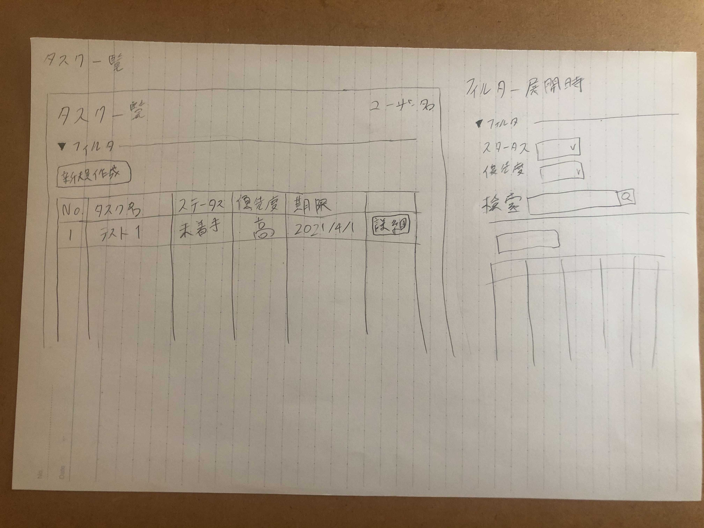
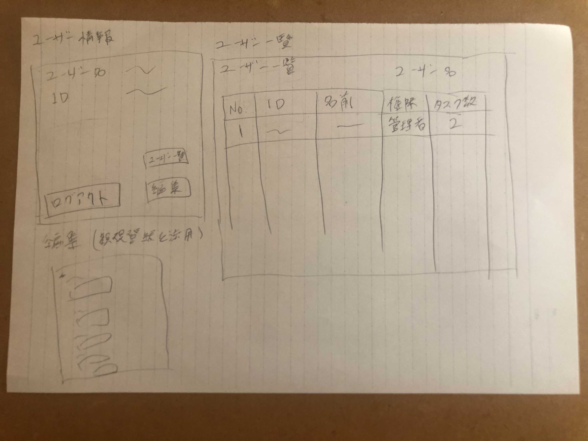

## 画面構成図

## DBスキーマ

### Usersテーブル
|      Field      |     Type     | Null | Key | Default |     Extra      |
| --------------- | ------------ | ---- | --- | ------- | -------------- |
| id              | BIGINT(20)   | NO   | PRI | NULL    | AUTO_INCREMENT |
| user_id         | VARCHAR(20)  | NO   |     | NULL    |                |
| name            | VARCHAR(100) | NO   |     | NULL    |                |
| password_digest | VARCHAR(255) | NO   |     | NULL    |                |
| authority       | VARCHAR(20)  | NO   |     | NULL    |                |
| created_at      | TIMESTAMP    | NO   |     | NULL    |                |
| updated_at      | TIMESTAMP    | NO   |     | NULL    |                |

### Tasksテーブル
|    Field    |     Type      | Null | Key | Default |     Extra      |
| ----------- | ------------- | ---- | --- | ------- | -------------- |
| id          | BIGINT(20)    | NO   | PRI | NULL    | AUTO_INCREMENT |
| user_id     | VARCHAR(20)   | NO   |     | NULL    |                |
| title       | VARCHAR(100)  | NO   |     | タスク   |                |
| description | VARCHAR(1000) | YES  |     | NULL    |                |
| status      | VARCHAR(10)   | NO   |     | 未着手   |                |
| priority    | VARCHAR(10)   | YES  |     | NULL    |                |
| deadline    | DATETIME      | YES  |     | NULL    |                |
| created_at  | TIMESTAMP     | NO   |     | NULL    |                |
| updated_at  | TIMESTAMP     | NO   |     | NULL    |                |
